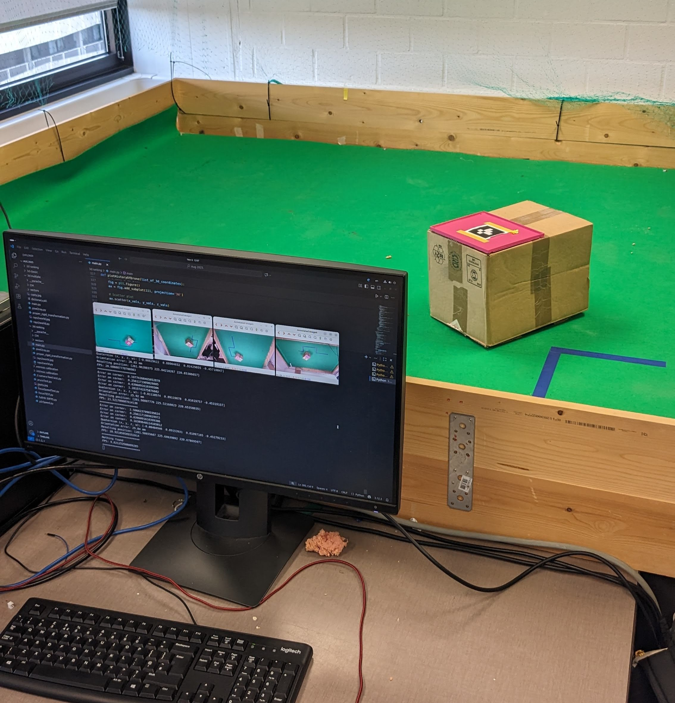
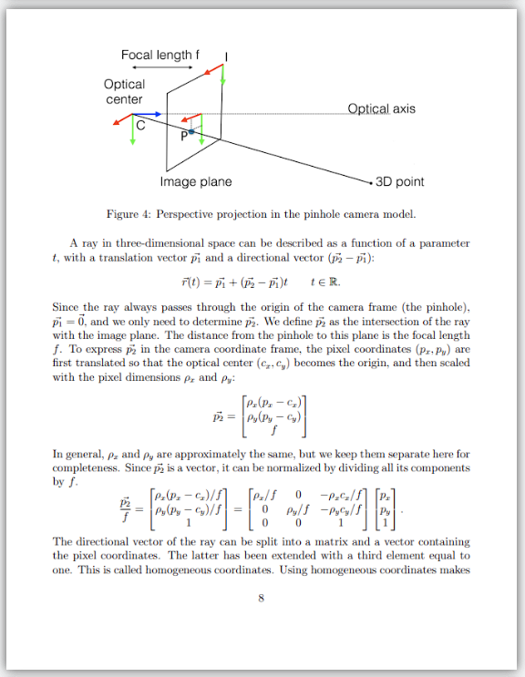
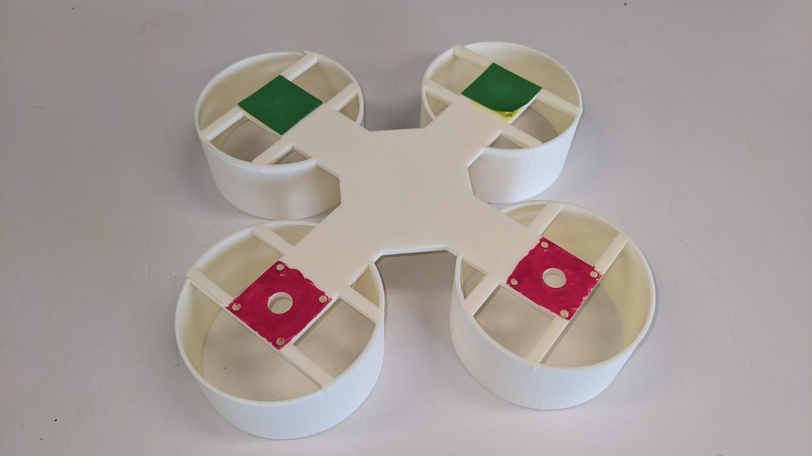
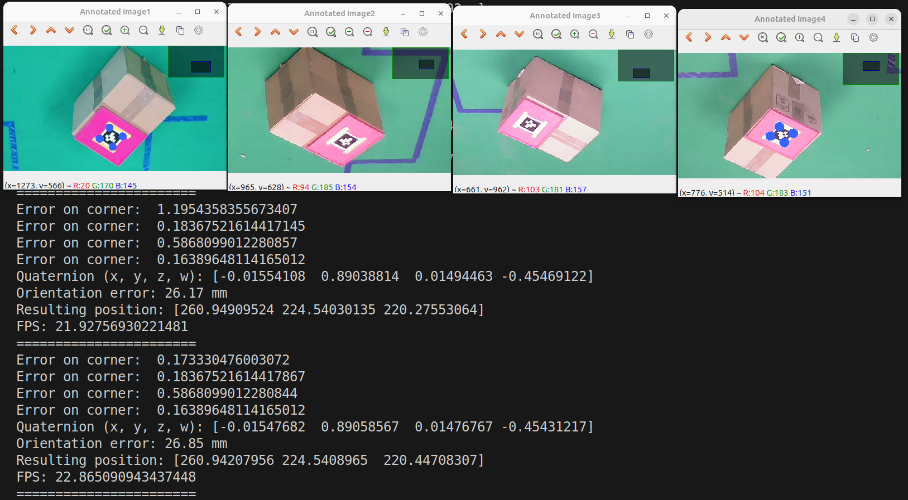

<!-- README.md - 3D Pose Estimation Tool -->

  <h1>3D Pose Estimation Tool</h1>
  <h3>Developed during a student research job at the Robotics Lab, Vrije Universiteit Brussel</h3>

---

## 📄 Overview

This repository contains a **Python-based 3D pose estimation tool** developed to support bachelor and master theses, as well as research projects, at the Vrije Universiteit Brussel (VUB).

A **formal research paper** documenting the full algorithm, mathematical derivation, and results is included in this repository as [paper.pdf](paper.pdf).

<figure>
  
  <figcaption>Excerpt from the included research paper (<a href="paper.pdf">paper.pdf</a>).</figcaption>
</figure>

The software estimates the 3D **position and orientation** of objects using multiple cameras and two types of fiducial markers:
- **ArUco markers** – robust but slower detection  
- **Colored dots** – fast detection, requires controlled environment

---

## 🖼️ Images & Examples
<figure>
  
  <figcaption>Example setup of a drone frame with four colored dots for detection.</figcaption>
</figure>

<figure>
  
  <figcaption>Screenshot of ArUco pose estimation in progress. Four cameras are tracking the marker; pose and error values are printed for iterative refinement.</figcaption>
</figure>

---

## ⚙️ Features
- Real-time 3D pose estimation  
- Automatic selection of best two cameras for tracking  
- Iterative error minimization and uncertainty estimation  
- Configurable for different marker types, sizes, and camera setups  
- Includes intrinsic and extrinsic camera calibration scripts  

---

## 🧭 Usage

Follow these steps to correctly set up and run the pose estimation system:

1. **Intrinsic Calibration**  
   - Run the `main.py` file inside the **`intrinsic_calibration/`** folder.  
   - This computes the **camera matrix** and distortion coefficients for each camera.  

2. **Extrinsic Calibration**  
   - Run the `main.py` file inside the **`extrinsic_calibration/`** folder.  
   - This determines the **rotation** and **translation vectors** for each camera relative to a global reference frame.  

3. **Colored Dot Detection (if using color markers)**  
   - Run the `main.py` file inside the **`HSV/`** folder to determine the HSV thresholds for color segmentation.  

4. **ArUco Marker Detection (if using ArUco markers)**  
   - In the **`2D/`** or **`3D/`** main script, update the **ArUco marker ID/number** to match the marker used in your setup.  

5. **Localization**  
   - Run `main.py` in either the **`2D/`** or **`3D/`** folder for final pose estimation and localization.  

> **Note:**  
> - **At least 2 cameras** are required for **3D localization**.  
> - **One or more cameras** can be used for **2D localization**.  

---

## 🛠️ Technologies & Libraries
- 
- 
- 

---
